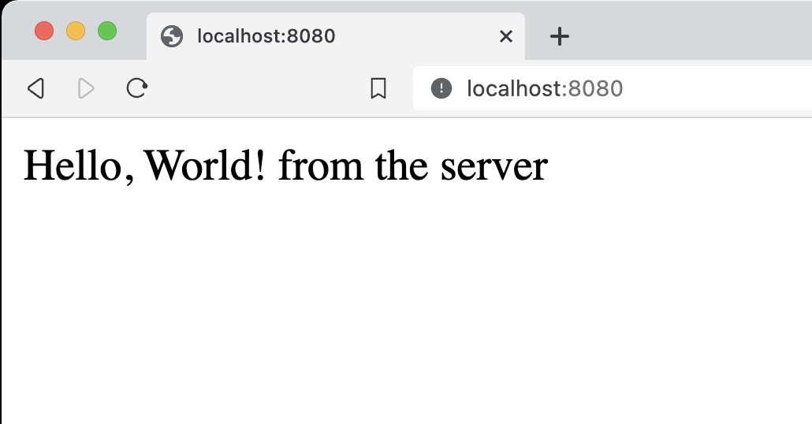
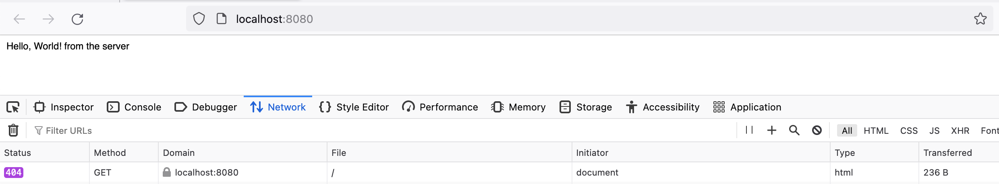

## Introduction

This small booklet has X parts illustrating small aspects of the construction of
a web server in JavaScript, a static web page using basic technologies like HTML
and CSS. And then how to develop a dynamic web page with events and dynamic
construction of HTML elements. 

The goal of this booklet is to illustrate the different aspects of the
construction of a web server in TypeScript. The booklet is not intended to be a
complete reference, but rather a quick guide to get you started.

# A Web Server in TypeScript

## Setting up your first node application

To start this adventure, we will start by setting up a simple `Node.js`
application. This will allow us to run JavaScript and TypeScript code outside of
the browser. Node.js is a JavaScript runtime environment that allows us to run
JavaScript and TypeScript code outside of the browser.
 
#. To start with you need to install `Node.js` in your computer. You can
download it from the [Node.js](https://nodejs.org) website. Next, we are going
to use command line instructions and a text editor. The recommended editor for
this journey is Visual Studio Code, with a few plug-ins that will be highlighted
along the way. 

#. To start, you need to create a directory for your project and initialize
it.

    ~~~bash
    mkdir myproject
    cd myproject
    npm init -y
    ~~~

    These commands will add a `package.json` file to your project. This file
    contains all the configuration information for your project.

#. Next, you need to install the TypeScript compiler and initialize it.
  
    ~~~bash
    npm install -g typescript
    tsc --init
    npm install ts-node typescript --save-dev
    ~~~

   These commands will add the file `tsconfig.json` to your project and install
  the necessary packages. This will contain the information for the TypeScript
  compiler to compile your code.

#. Next, you need to write your first TypeScript file. Create a file called `index.ts` in a folder called `src`.

    > **_TODO_**: Create src folder: add code snippet

    ~~~javascript
    console.log("Hello World");
    ~~~

#. Change your `package.json` file and modify the "start" script to run your program.

    ~~~javascript
    "scripts": {
        "start": "ts-node index.ts"
    },
    ~~~

#. Finally, you can run your program with the following command:

    ~~~bash
    npm start
    ~~~

  You should see the message "Hello World" printed in the console.
  Congratulations, you have succeeded in writing and running your first
  TypeScript application.

## Setting up your first web server

A Web server is a program that listens to requests from a browser and returns a
response. Responses can be HTML pages, images, JSON data, etc. Content can be
either static if provided by an existing file in the server filesystem, or
dynamic if it is created on demand and based on the information from the request.

#. Start by clearing the `index.ts` file. To start designing a basic
web server, we will use the `http` module. Write the following declarations into the 
`index.ts` file.

    ~~~javascript
    import http from 'http'
    ~~~

#. Then we need some constants to determine the address and port of our
server. Write the following declarations next to the previous one.

    ~~~javascript
    const host = 'localhost';
    const port = 8080;
    ~~~

#. Next, we need to write a function that will handle the requests. This
function accepts two objects as parameters: the request and the response. For
now, we are just going to return a simple HTML page for all requests. Write the
following code in the `index.ts` file.

    ~~~javascript
    function doRequests(
        req:IncomingMessage, 
        res:ServerResponse) {

      const page = `
        <HTML>
          <BODY>
            Hello, World! from the server
          </BODY>
        </HTML>
      `
      res.setHeader("Content-Type", 
                    "text/html");
      res.writeHead(200)
      res.end(page)
    }
    ~~~
  
   Notice that the immutable variable `page` contains the HTML code for a simple
  page and that the object `res` is used to set the headers, and the return code
  of the response. The `end` method is used to send the result to the browser,
  in the body section. Notice the use of the backtick quotes to define a string
  over several lines in the file.

   Since we need to use type annotations for the function parameters, we need to
  import types `IncomingMessage` and `ServerResponse`. So, we need to update our
  import statement to include these.

    ~~~javascript
    import http, {IncomingMessage, ServerResponse} from 'http'
    ~~~

#. Next, we need to create the server and start listening to requests. Write
the following code in your file:

    ~~~javascript
    const server = 
      http
      .createServer(doRequests);

    server.listen(
      port, 
      host, 
      () => {
        console.log(`Server is running on http://${host}:${port}`);
      }
    );
    ~~~

    We first create an object called `server` based on the previously defined
    function doRequests. Then we call the `listen` method on the server
    object to start listening to requests. The `listen` method accepts three
    parameters: the port, the host, and a callback function that is called when the
    server is ready to accept requests.
    In this case, the backtick quotes are used to define an interpolated string with
    the host and port values.

#. Your `index.ts` file should look like this by now:

    ~~~javascript
    import http, {IncomingMessage, ServerResponse} from 'http'
    const host = 'localhost';
    const port = 8080;
    const basedir = "./public"
    function doRequests(
      req:IncomingMessage, 
      res:ServerResponse) {
        const page = `
            <HTML>
              <BODY>
                Hello, World! from the server
              </BODY>
            </HTML>
            `
        res.setHeader("Content-Type", "text/html");
        res.writeHead(200)
        res.end(page)
    }

    const server = 
      http
      .createServer(doRequests);

    server.listen(
      port, 
      host, 
      () => {
        console.log(`Server is running on http://${host}:${port}`);
      }
    );
    ~~~

#. Finally, you can run your program with the following command:

    ~~~bash
    npm start
    ~~~
  
    You should see the message "Server is running on http://localhost:8080" printed in the console. If you go to a browser and use that same URL, you should see 
      
    
      
    Congratulations, you have succeeded in writing and running your webserver using
    TypeScript.

    (You can find the final code in the file `index.ts` in the folder chapter2 of
    this guide.)

## Returning a 404 error

In the previous example, your web server returns a successful response when you access the URL (`localhost:8080`). 

When accessing a URL, your browser receives the response (i.e. the content of the webpage), and also receives an HTTP
code denoting the nature of the response. In the previous case, since the response is successful (i.e. the page exists
and no error occurred when accessing it), the server returns the HTTP status code `200 OK`.

However, in some cases, accessing a URL may return an error. For instance, when you access a [non-existing page](), you
typically receive a `404 Not Found` status code. This signals to your web browser that the page does not exist, and
allows it to react accordingly[^1].

[^1]: For an extensive list of HTTP status codes, you can check [this](https://developer.mozilla.org/en-US/docs/Web/HTTP/Status) page.

Let's change the code in our web server to return a `404 Not found`. Start by opening the `index.ts` file in the root of
your project, and find the following line:

~~~javascript
res.writeHead(200)
~~~

This makes your webserver return a `200 OK` status code. Let's change this to return `404 Not found`:

~~~javascript
res.writeHead(404)
~~~

Now, run your web-server again:

~~~bash
npm start
~~~

If you navigate with your browser to the URL (`localhost:8080`), you still see the same page as before. To see the error
code, you can open the developer tools[^2], and then open the **Network** tab. Now, if you reload the page, you should
see the 404 error being returned from the server.

In general, a web server should return a different page depending on the HTTP status code. We'll explore this in the
next step, where we will return a `404 Not found` page if a user tries to access a non-existing file.

[^2]: In Firefox: **Tools > Browser Tools > Web Developer Tools**; In Chrome: **View > Developer > Developer Tools**.

<!-- ~~~javascript
function doRequests(req:IncomingMessage, res:ServerResponse) {
  console.log(req.method + ": " + req.url)

  switch (req.url) {
      case "/hello":
          const page = 
          `<HTML>
              <BODY>
                  Hello, World! from the server
              </BODY>
          </HTML>`
          res.setHeader("Content-Type", "text/html");
          res.writeHead(200)
          res.end(page)
          break;

      default:
          res.writeHead(404)
          res.end()
          break;
  }
}
~~~ -->

## Returning static content

In this section, we'll enhance our web server to serve static content such as HTML, CSS, and JavaScript files. This
allows us to serve pre-existing files, such as HTML pages, images, or videos, from our server.

To do so, let's start by changing the code of the `doRequests` function, in the file `index.ts`.

We start by writing a `switch` statement, which we use to determine the action to take based on the requested URL.

~~~javascript
function doRequests(req, res) {
  console.log(req.method + ": "+ req.url)
  switch (req.url) {
    ...
  }
~~~

Now, inside the `switch` statement we can write the different cases. Each
case represents a specific URL route, and depending on the requested URL, different actions are performed, such as
returning a predefined HTML page or serving a static file from the server.

The first case is for the URL `/hello`, which should display the same page we used in the previous example. Let's add this case to the `switch` statement:

~~~javascript
function doRequests(req, res) {
  console.log(req.method + ": "+ req.url)
  switch (req.url) {
  case "/hello":
    const page = "<HTML><BODY>Hello, World! from the server</BODY></HTML>"
    res.setHeader("Content-Type", "text/html");
    res.writeHead(200)
    res.end(page)
    break;
}
~~~

Now, if you start the web server and access the URL `/hello`, the browser will display a simple HTML page that says "Hello, World! from the server".

Let's add another case. For any other URL request (that is not `/hello`), we want to attempt to read the corresponding file from the `public/` directory and serve it. To implement this we can use the `default` case, which is executed when none of the defined cases match the requested URL.

~~~javascript
function doRequests(req, res) {
  console.log(req.method + ": "+ req.url)
  basedir = './public'
  switch (req.url) {
    case "/hello":
      ...
    default:
      fs
      .readFile(basedir + req.url)
      .then(function(data) {
        res.setHeader("Content-Type", "text/html");
        res.writeHead(200)
        res.end(data)
      })
      .catch(function () {
        res.writeHead(404)
        res.end()
      })
      break;
  }
~~~

If the file is found, we serve it's content (`data`) with an HTTP status code of 200 (OK) along with the appropriate
content type header. If the file is not found, we return a 404 (Not Found) status code.

By handling these cases, our web server becomes capable of serving static files, making it more versatile for building web applications.

## Returning static content: an index

In this section, we'll further enhance our web server to serve an index page when the root URL (`/`) is accessed. This index page serves as the main entry point for our website and typically contains links to other pages or resources.

To implement this, we'll add another case to our switch statement in the `doRequests` function to handle requests to the
root URL (`/`). When the root URL is accessed, we'll read the content of the `index.html` file from the `public/`
directory and serve it to the client.

~~~javascript
case "/":
  fs
  .readFile(basedir + "/index.html")
  .then(function(data) {
    res.setHeader("Content-Type", "text/html");
    res.writeHead(200)
    res.end(data)
  })
  .catch(function () {
    res.writeHead(404)
    res.end()
  })
  break;
~~~

Now, if you start the web server and access the URL (`http://localhost:8080`), you should see the contents of the `public/index.html` file displayed.

## Returning dynamic content

In this section, we'll explore how to return dynamic content from our web server. Dynamic content refers to web pages
that are generated on-the-fly in response to user input or other external factors. We'll specifically focus on handling
both `GET` and `POST` requests to return different responses based on the request method.

In the previous step, we added a case to serve the `index.html` when the root of the web server is accessed. In this page (which you can view by starting the server and going to `http://localhost:8080`), there is a form with a field called `name`. You can check this by inspecting the `index.html` file, located in the `public` folder:

~~~html
<form action="/hello" method="POST">
      Give me a name: <input type="text" name="name">
    </form>
~~~

This markup indicates to the browser that when the user submits the form, a `POST` request (method) should be made to the endpoint `/hello` (action), containing a key-value pair where the key is `name` (the name of the field) the value is what the user provides as input for that field.

To handle this, we need to change the code corresponding to the `/hello` case. Let's start by modifying this case in the code (`index.ts` file). First, we need to check the type of the request. If the request is a `GET`, then we simply serve the same HTML content as before. If the request is a `POST` (meaning that a user submitted the form to this endpoint), then we need to handle the form data and act accordingly.

~~~javascript
function doRequests(req, res) {
  console.log(req.method + ": "+ req.url)
  switch (req.url) {
    case "/hello":
      if( req.method == "GET" ) {
        const page = `
          <HTML>
            <BODY>Hello, World! from the server</BODY>
          </HTML>
        `
        res.setHeader("Content-Type", "text/html");
        res.writeHead(200)
        res.end(page)
        break;
      } else if( req.method == "POST") {
        ...
      }
~~~

For this example, when the user submits the form, we want to return a webpage with the content:

~~~
Hello, <name>! through a POST HTTP request
~~~

replacing `<name>` with whatever value the user submits in the form.

To do so, we can add the following code to `else if` statement, which is executed when the form is submitted:

~~~javascript
let body = ""
req.on('data', chunk => { body = body + chunk })
req.on('end', () => {
  let formData = parse(body)
  const page = `
    <HTML>
      <BODY>
        Hello, ${formData["name"]}! through a POST HTTP request
      </BODY>
    </HTML>
  `
  res.setHeader("Content-Type", "text/html");
  res.writeHead(200)
  res.end(page)
})
break;
~~~

The values that the user submits in the form are held in the `formData` array. The values are indexed by their corresponding `name` attribute in the HTML file, so to get the `name` field we simply access `formData["name"]`.

## Webservices: returning JSON data

- server-5

<!-- # A Web page using HTML and CSS

## HTML: Writing your first web page

## HTML: The anatomy of an HTML element

## HTML: Basic Text Formatting

## HTML: Adding images

## HTML: Linking different pages

## HTML: Formatting with stylesheets

## HTML: Basic Layout with CSS

## HTML: Making requests with Forms

# Reactive pages: Events and JavaScript

# Dynamic pages with JavaScript -->
